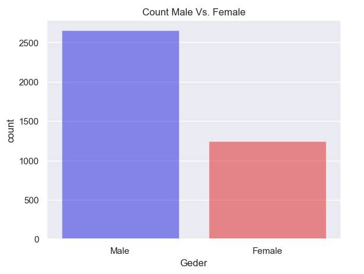
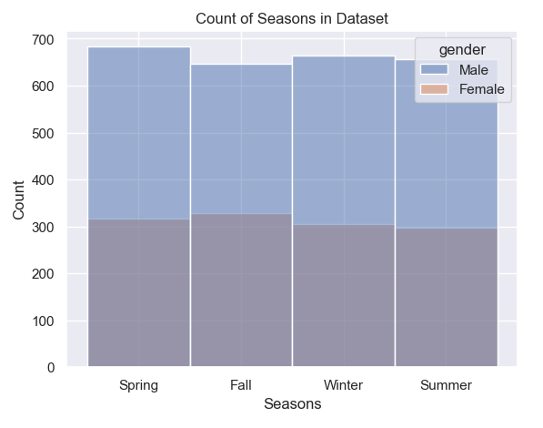
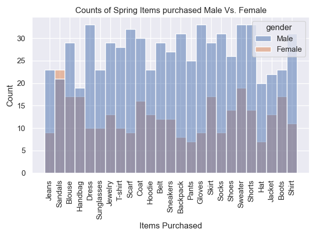
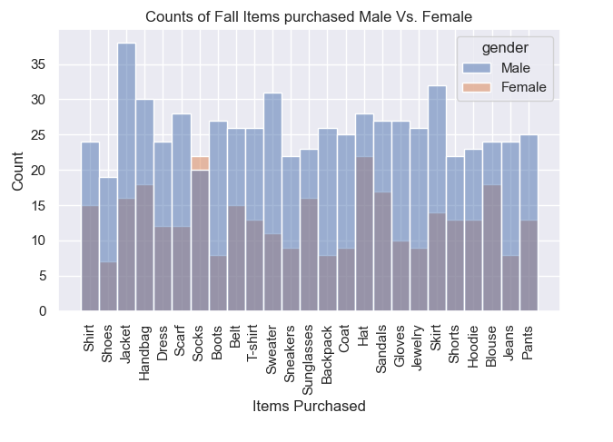
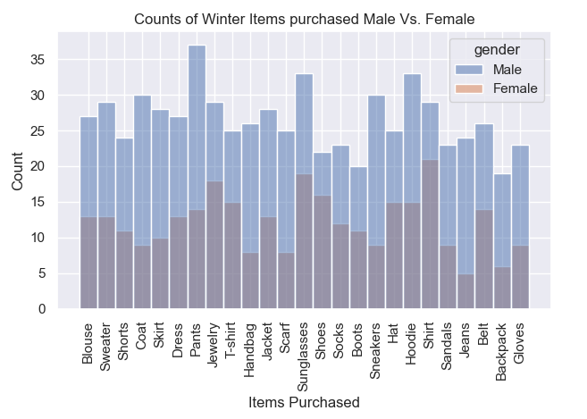
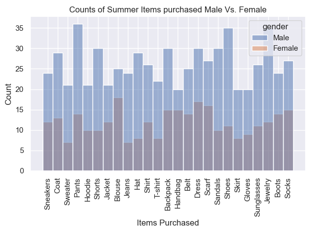
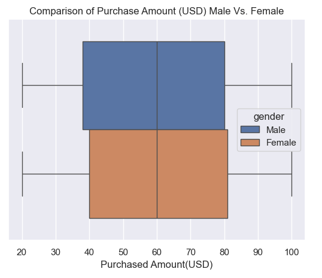

# Customer Shopping Trends

This project is from a Dataset I found on [kaggle](https://www.kaggle.com/datasets/bhadramohit/customer-shopping-latest-trends-dataset/data), This dataset made me curious to know what trends are occuring now. I want to see if i can find any meaningful insight for this project between the seasons, male and female, and items that were purchased. 

## Problem Statement
In this project I wanted to see the difference in male and female purchases within the seasons that are provided in the dataset. To find further if male or female spends more in amount of purchases and amount in total spending. This can benefit shop owners who want to target a specific gender in seasons they would want more revenue for their business. 

##Data Dictionary

| Column Name | Description |
|-------------|-------------|
| Customer ID | The Identification of the Customer |
| Age | The age of th Customer |
| Gender | The gender of the cumstomer male or female |
| Item Purchased | The discription of the item purchased |
| Catagory | The catagory of the item that was purchased |
| Purchased Amount (USD) | The amount spent in USD for the item purchased |
| Location | Shows the state the customer resides |
| Size | The size of the item purchased |
| Color | The color of the item purchsed |
| Season | What season the item was purchased |
| Review Rating| Rating of the item purchased |
| Subscription Status  | Shows if the customer has a subsrciption |
| Payment Method | Shows how the Customer payed for the item |
| Shipping Type | Shows the type of shipping the customer chose |
| Discount Applied | Shows if there was a discount applied on the item puchased |
| Promo Code Used | Shows if there was a promotion used on the item purchased |
| Previous Purchases | Shows the number of purchases made before the item purchased |
| Preferred Payment Method | Shows the method of payment that is used the most |
| Frequency of Purchases | Shows how often the customer purchases items |

## Executive Summary

###Data Cleaning Steps
With the dataset given there was no NaN Values, So the Cleaning Process was none. Made exploring the data much easier. 

### Key Visualizations

#### Visualization 1: [Count Male Vs. Female]
> This is showing that in this dataset there are more male then female

#### Visualization 2: [Count of Seasons in Dataset]
>This shows spring being the hieghest time for purchases and as male showing the most about 683 of males

#### Visualization 3: [Counts of Spring Items purchased Male Vs. Female]
>This shows male purchses more in spring with the item being sweater as the most item with about 33 times

#### Visualization 4: [Counts of Fall Items purchased Male Vs. Female]
>This show male being the highest purchaser with the nuber one items being jacket in fall with 38 purcheses

#### Visualization 5: [Counts of Winter Items purchased Male Vs. Female]
>This shows male being the highest purcheser in winter with pants being number one item with 37 purchases

#### Visualization 6: [Counts of Summer Items purchased Male Vs. Female]
>This shows that male is the highest in summer with pants being the most item with 36 purchases

#### Visualization 7: [Comparison of Items purchased Male Vs. Female]
>This shows that male purchase more items overall in previous purchases

#### Visualization 8: [Comparison of Purchase Amount (USD) Male Vs. Female]
>This is showing that Female spend slightly more on items than male about 0.7% more on average

## Conclusions/Recommendations
Even with female having higher amount spending per item than male. It shows overall that male outnumbered female by almost 70% giving most outcomes to male as the highest in overall. If there was an equal number of male and female we would be able to find a more accurate unbiased info. It would be interesting to see what the difference would be with an equal number of customers being male and female. I would Like to have the information on the actual discount amount and promotions to see if the case with actual spending is capturing the actual spending per item.
