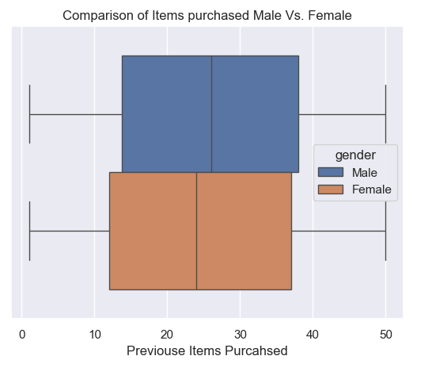

# Customer Shopping Trends

This project is based on a dataset I found on [Kaggle](https://www.kaggle.com/datasets/bhadramohit/customer-shopping-latest-trends-dataset/data). The dataset sparked my curiosity about current shopping trends, and I wanted to explore whether meaningful insights could be drawn from it. Specifically, I aim to analyze purchasing patterns across different seasons, genders, and product categories.   

## Problem Statement
The goal of this project is to examine the differences in male and female purchasing behaviors across the seasons provided in the dataset. I aim to determine whether one gender tends to spend more—both in terms of purchase frequency and total spending. These insights could be valuable for shop owners looking to optimize their marketing strategies and target specific demographics during peak seasons to maximize revenue. 

##Data Dictionary

| Column Name               | Description |
|---------------------------|-------------|
| Customer ID               | Unique identifier for each customer. |
| Age                       | The age of the customer. |
| Gender                    | The gender of the customer (Male or Female). |
| Item Purchased            | Description of the purchased item. |
| Category                  | The category of the purchased item. |
| Purchased Amount (USD)    | The amount spent in USD for the purchased item. |
| Location                  | The state where the customer resides. |
| Size                      | The size of the purchased item.  |
| Color                     | The color of the purchased item. |
| Season                    | The season during which the item was purchased. |
| Review Rating             | The rating given to the purchased item. |
| Subscription Status       | Indicates whether the customer has a subscription. |
| Payment Method            | The method used by the customer to pay for the item. |
| Shipping Type             | The type of shipping chosen by the customer. |
| Discount Applied          | Indicates if a discount was applied to the purchase. |
| Promo Code Used           | Indicates if a promotional code was used for the purchase. |
| Previous Purchases        | The number of purchases made by the customer before this purchase. |
| Preferred Payment Method  | The payment method most frequently used by the customer. |
| Frequency of Purchases    | How often the customer makes purchases. |

## Executive Summary

###Data Cleaning Steps
The dataset provided contained no missing (NaN) values, eliminating the need for a data cleaning process. This made exploring the data much easier and allowed for a more seamless analysis.

### Key Visualizations

#### Visualization 1: [Count Male Vs. Female]
> The dataset indicates that there are more male customers than female customers.

#### Visualization 2: [Count of Seasons in Dataset]
> The data shows that spring is the peak season for purchases, with male customers making the most purchases—approximately 683 transactions.

#### Visualization 3: [Counts of Spring Items purchased Male Vs. Female]
> The data shows that males make more purchases in spring, with sweaters being the most purchased item, bought approximately 33 times.

#### Visualization 4: [Counts of Fall Items purchased Male Vs. Female]
> The data shows that males are the highest purchasers, with jackets being the top item purchased in the fall, totaling 38 purchases.

#### Visualization 5: [Counts of Winter Items purchased Male Vs. Female]
> The data shows that males are the highest purchasers in winter, with pants being the top item, purchased 37 times.

#### Visualization 6: [Counts of Summer Items purchased Male Vs. Female]
> The data shows that males are the highest purchasers in summer, with pants being the most purchased item, totaling 36 purchases.

#### Visualization 7: [Comparison of Items purchased Male Vs. Female]
> The data shows that males make more overall purchases in previous transactions.

#### Visualization 8: [Comparison of Purchase Amount (USD) Male Vs. Female]
> The data shows that females spend slightly more on items than males, with an average difference of about 0.7%.

## Conclusions/Recommendations
Although females spend slightly more per item than males, the data shows that males outnumber females by almost 70%, leading to a higher overall spending from males. If there were an equal number of male and female customers, we could potentially derive more accurate and unbiased insights. It would be interesting to analyze the difference with an equal number of male and female customers. Additionally, having information on the actual discount amounts and promotions would be valuable to verify if the reported spending accurately reflects the actual expenditure per item.
